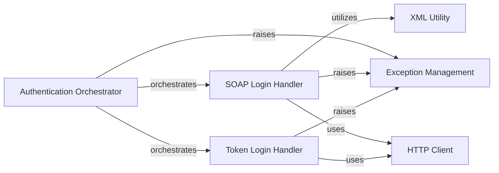

## Component Details

This component overview details the Salesforce authentication and session management subsystem within `simple-salesforce`. The `Authentication Orchestrator` acts as the central entry point, directing various authentication flows (username/password, OAuth 2.0, JWT, client credentials) to either the `SOAP Login Handler` or the `Token Login Handler`. Both login handlers interact with the Salesforce API via an `HTTP Client` and are responsible for extracting session details from responses. `Exception Management` provides a unified way to handle authentication errors across the subsystem, while `XML Utility` assists in parsing SOAP responses.

### Authentication Orchestrator
This component serves as the primary entry point for all Salesforce authentication flows. It analyzes the provided credentials and parameters to determine the appropriate underlying login mechanism (SOAP-based or token-based) and delegates the authentication request accordingly. It also handles initial validation of input parameters and raises authentication failures.

**Related Classes/Methods**:

- <a href="https://github.com/simple-salesforce/simple-salesforce/blob/master/simple_salesforce/login.py#L26-L228" target="_blank" rel="noopener noreferrer">`simple_salesforce.login.SalesforceLogin` (26:228)</a>

### SOAP Login Handler
This component is responsible for executing SOAP-based authentication requests to Salesforce. It constructs the SOAP envelope, sends the request, and parses the XML response to extract the session ID and instance URL. It also handles SOAP-specific error responses and raises authentication exceptions.

**Related Classes/Methods**:

- <a href="https://github.com/simple-salesforce/simple-salesforce/blob/master/simple_salesforce/login.py#L231-L274" target="_blank" rel="noopener noreferrer">`simple_salesforce.login.soap_login` (231:274)</a>

### Token Login Handler
This component manages token-based authentication flows, including OAuth 2.0 password, JWT bearer, and client credentials grants. It sends POST requests to the OAuth2 token endpoint, processes the JSON response to retrieve access tokens and instance URLs, and handles token-specific errors.

**Related Classes/Methods**:

- <a href="https://github.com/simple-salesforce/simple-salesforce/blob/master/simple_salesforce/login.py#L277-L319" target="_blank" rel="noopener noreferrer">`simple_salesforce.login.token_login` (277:319)</a>

### Exception Management
This component defines and manages custom exceptions specific to Salesforce authentication failures. It provides a standardized way to signal and propagate errors encountered during the login process, such as invalid credentials or API issues.

**Related Classes/Methods**:

- <a href="https://github.com/simple-salesforce/simple-salesforce/blob/master/simple_salesforce/exceptions.py#L96-L113" target="_blank" rel="noopener noreferrer">`simple_salesforce.exceptions.SalesforceAuthenticationFailed` (96:113)</a>

### XML Utility
This component provides utility functions for parsing XML strings, specifically designed to extract element values from SOAP responses. It is crucial for processing the data returned by SOAP-based Salesforce API calls.

**Related Classes/Methods**:

- <a href="https://github.com/simple-salesforce/simple-salesforce/blob/master/simple_salesforce/util.py#L35-L56" target="_blank" rel="noopener noreferrer">`simple_salesforce.util.getUniqueElementValueFromXmlString` (35:56)</a>

### HTTP Client
This component represents the external library responsible for making HTTP requests to the Salesforce API endpoints. It handles the underlying network communication for both SOAP and token-based authentication.

**Related Classes/Methods**: _None_

### [FAQ](https://github.com/CodeBoarding/GeneratedOnBoardings/tree/main?tab=readme-ov-file#faq)