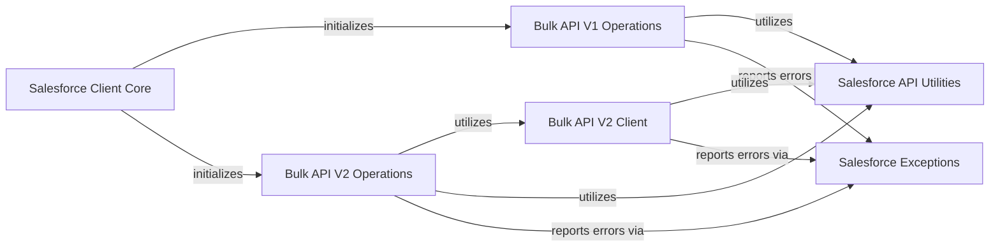

## Component Details

This graph illustrates the architecture of the Salesforce Bulk API Client, which manages interactions with both Salesforce Bulk API v1 and v2. It facilitates large-scale asynchronous data operations such as insert, update, delete, upsert, and query, handling job creation, batch management, and result retrieval for both API versions. The main flow involves the Salesforce Client Core initializing and providing access to the Bulk API V1 and V2 operations, which in turn utilize a dedicated Bulk API V2 Client for V2 operations and common Salesforce API Utilities for various tasks, with all components reporting errors via Salesforce Exceptions.

### Salesforce Client Core
The central component responsible for initializing and providing access to various Salesforce API functionalities, including Bulk API versions.

**Related Classes/Methods**:

- `simple_salesforce.api.Salesforce` (full file reference)

### Bulk API V1 Operations
Handles all operations related to the Salesforce Bulk API version 1, including job creation, batch management, and data processing.

**Related Classes/Methods**:

- <a href="https://github.com/simple-salesforce/simple-salesforce/blob/master/simple_salesforce/bulk.py#L18-L66" target="_blank" rel="noopener noreferrer">`simple_salesforce.bulk.SFBulkHandler` (18:66)</a>
- <a href="https://github.com/simple-salesforce/simple-salesforce/blob/master/simple_salesforce/bulk.py#L69-L657" target="_blank" rel="noopener noreferrer">`simple_salesforce.bulk.SFBulkType` (69:657)</a>

### Bulk API V2 Operations
Manages interactions with the Salesforce Bulk API version 2, providing functionalities for creating, managing, and querying bulk jobs, as well as handling data uploads and downloads.

**Related Classes/Methods**:

- <a href="https://github.com/simple-salesforce/simple-salesforce/blob/master/simple_salesforce/bulk2.py#L149-L179" target="_blank" rel="noopener noreferrer">`simple_salesforce.bulk2.SFBulk2Handler` (149:179)</a>
- <a href="https://github.com/simple-salesforce/simple-salesforce/blob/master/simple_salesforce/bulk2.py#L443-L669" target="_blank" rel="noopener noreferrer">`simple_salesforce.bulk2.SFBulk2Type` (443:669)</a>

### Bulk API V2 Client
An internal client component specifically designed for making low-level API calls to the Salesforce Bulk API version 2. It handles request construction and direct communication.

**Related Classes/Methods**:

- <a href="https://github.com/simple-salesforce/simple-salesforce/blob/master/simple_salesforce/bulk2.py#L182-L440" target="_blank" rel="noopener noreferrer">`simple_salesforce.bulk2._Bulk2Client` (182:440)</a>

### Salesforce API Utilities
A collection of helper functions that provide common utilities such as making HTTP requests to Salesforce, handling data transformations (e.g., CSV processing), and general list manipulations.

**Related Classes/Methods**:

- <a href="https://github.com/simple-salesforce/simple-salesforce/blob/master/simple_salesforce/util.py#L92-L110" target="_blank" rel="noopener noreferrer">`simple_salesforce.util.call_salesforce` (92:110)</a>
- <a href="https://github.com/simple-salesforce/simple-salesforce/blob/master/simple_salesforce/util.py#L112-L119" target="_blank" rel="noopener noreferrer">`simple_salesforce.util.list_from_generator` (112:119)</a>
- <a href="https://github.com/simple-salesforce/simple-salesforce/blob/master/simple_salesforce/bulk2.py#L113-L127" target="_blank" rel="noopener noreferrer">`simple_salesforce.bulk2._count_csv` (113:127)</a>
- <a href="https://github.com/simple-salesforce/simple-salesforce/blob/master/simple_salesforce/bulk2.py#L69-L110" target="_blank" rel="noopener noreferrer">`simple_salesforce.bulk2._split_csv` (69:110)</a>
- <a href="https://github.com/simple-salesforce/simple-salesforce/blob/master/simple_salesforce/bulk2.py#L130-L146" target="_blank" rel="noopener noreferrer">`simple_salesforce.bulk2._convert_dict_to_csv` (130:146)</a>

### Salesforce Exceptions
Defines custom exception classes to represent various error conditions encountered during interactions with the Salesforce API, allowing for structured error handling.

**Related Classes/Methods**:

- <a href="https://github.com/simple-salesforce/simple-salesforce/blob/master/simple_salesforce/exceptions.py#L116-L124" target="_blank" rel="noopener noreferrer">`simple_salesforce.exceptions.SalesforceGeneralError` (116:124)</a>
- <a href="https://github.com/simple-salesforce/simple-salesforce/blob/master/simple_salesforce/exceptions.py#L137-L140" target="_blank" rel="noopener noreferrer">`simple_salesforce.exceptions.SalesforceBulkV2ExtractError` (137:140)</a>
- <a href="https://github.com/simple-salesforce/simple-salesforce/blob/master/simple_salesforce/exceptions.py#L127-L128" target="_blank" rel="noopener noreferrer">`simple_salesforce.exceptions.SalesforceOperationError` (127:128)</a>
- <a href="https://github.com/simple-salesforce/simple-salesforce/blob/master/simple_salesforce/exceptions.py#L131-L134" target="_blank" rel="noopener noreferrer">`simple_salesforce.exceptions.SalesforceBulkV2LoadError` (131:134)</a>

### [FAQ](https://github.com/CodeBoarding/GeneratedOnBoardings/tree/main?tab=readme-ov-file#faq)