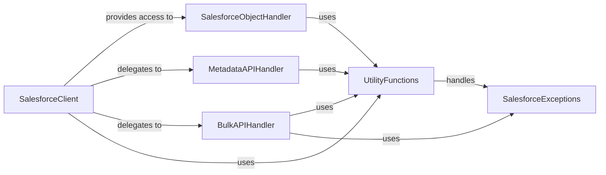

## Component Details

This component provides the primary interface for interacting with the Salesforce REST API. It handles session management, general queries (SOQL), searches (SOSL), direct REST calls, and acts as a gateway to specific SObject types (via SFType), Bulk API v1, Bulk API v2, and Metadata API.

### SalesforceClient
The primary interface for interacting with the Salesforce REST API, handling session management, authentication, and providing methods for general API operations.

**Related Classes/Methods**:

- <a href="https://github.com/simple-salesforce/simple-salesforce/blob/master/simple_salesforce/api.py#L39-L460" target="_blank" rel="noopener noreferrer">`simple_salesforce.api.Salesforce` (39:460)</a>

### SalesforceObjectHandler
Manages operations on specific Salesforce object types, facilitating standard CRUD operations and providing access to object-specific metadata.

**Related Classes/Methods**:

- <a href="https://github.com/simple-salesforce/simple-salesforce/blob/master/simple_salesforce/api.py#L463-L549" target="_blank" rel="noopener noreferrer">`simple_salesforce.api.SFType` (463:549)</a>

### MetadataAPIHandler
Manages interactions with the Salesforce Metadata API, enabling deployment of metadata components and checking deployment status.

**Related Classes/Methods**:

- <a href="https://github.com/simple-salesforce/simple-salesforce/blob/master/simple_salesforce/metadata.py#L196-L656" target="_blank" rel="noopener noreferrer">`simple_salesforce.metadata.SfdcMetadataApi` (196:656)</a>

### BulkAPIHandler
Provides functionality for executing bulk data operations against Salesforce, encompassing both Bulk API v1 and v2.

**Related Classes/Methods**:

- <a href="https://github.com/simple-salesforce/simple-salesforce/blob/master/simple_salesforce/bulk.py#L18-L66" target="_blank" rel="noopener noreferrer">`simple_salesforce.bulk.SFBulkHandler` (18:66)</a>
- `simple_salesforce.bulk2.SFBulk2Handler` (full file reference)

### UtilityFunctions
A collection of helper functions supporting various operations across the library, including error handling and data format conversions.

**Related Classes/Methods**:

- `simple_salesforce.util` (full file reference)

### SalesforceExceptions
Defines custom exception types used throughout the simple-salesforce library to provide specific error information for API interaction issues.

**Related Classes/Methods**:

- `simple_salesforce.exceptions` (full file reference)

### [FAQ](https://github.com/CodeBoarding/GeneratedOnBoardings/tree/main?tab=readme-ov-file#faq)