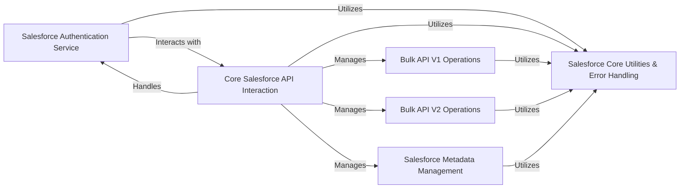

## Component Details

This graph illustrates the core components of the `simple-salesforce` library, highlighting the central role of the `Salesforce Core Utilities & Error Handling` component. This foundational component consolidates common utility functions, robust exception handling, and SOQL query formatting, serving as a shared dependency for various API interaction components. The overview details how different parts of the library, such as Bulk API operations, authentication, and general API interactions, rely on these core utilities and error management capabilities to ensure consistent and reliable communication with the Salesforce platform.

### Salesforce Core Utilities & Error Handling
This foundational component provides common utility functions, robust exception handling, and SOQL query formatting capabilities used across the `simple-salesforce` library to support various API interactions and ensure structured error reporting.

**Related Classes/Methods**:

- <a href="https://github.com/simple-salesforce/simple-salesforce/blob/master/simple_salesforce/util.py#L92-L110" target="_blank" rel="noopener noreferrer">`simple_salesforce.util.call_salesforce` (92:110)</a>
- <a href="https://github.com/simple-salesforce/simple-salesforce/blob/master/simple_salesforce/util.py#L70-L89" target="_blank" rel="noopener noreferrer">`simple_salesforce.util.exception_handler` (70:89)</a>
- <a href="https://github.com/simple-salesforce/simple-salesforce/blob/master/simple_salesforce/util.py#L112-L119" target="_blank" rel="noopener noreferrer">`simple_salesforce.util.list_from_generator` (112:119)</a>
- <a href="https://github.com/simple-salesforce/simple-salesforce/blob/master/simple_salesforce/util.py#L59-L67" target="_blank" rel="noopener noreferrer">`simple_salesforce.util.date_to_iso8601` (59:67)</a>
- <a href="https://github.com/simple-salesforce/simple-salesforce/blob/master/simple_salesforce/util.py#L35-L56" target="_blank" rel="noopener noreferrer">`simple_salesforce.util.getUniqueElementValueFromXmlString` (35:56)</a>
- <a href="https://github.com/simple-salesforce/simple-salesforce/blob/master/simple_salesforce/exceptions.py#L5-L39" target="_blank" rel="noopener noreferrer">`simple_salesforce.exceptions.SalesforceError` (5:39)</a>
- <a href="https://github.com/simple-salesforce/simple-salesforce/blob/master/simple_salesforce/exceptions.py#L42-L49" target="_blank" rel="noopener noreferrer">`simple_salesforce.exceptions.SalesforceMoreThanOneRecord` (42:49)</a>
- <a href="https://github.com/simple-salesforce/simple-salesforce/blob/master/simple_salesforce/exceptions.py#L52-L59" target="_blank" rel="noopener noreferrer">`simple_salesforce.exceptions.SalesforceMalformedRequest` (52:59)</a>
- <a href="https://github.com/simple-salesforce/simple-salesforce/blob/master/simple_salesforce/exceptions.py#L62-L69" target="_blank" rel="noopener noreferrer">`simple_salesforce.exceptions.SalesforceExpiredSession` (62:69)</a>
- <a href="https://github.com/simple-salesforce/simple-salesforce/blob/master/simple_salesforce/exceptions.py#L72-L79" target="_blank" rel="noopener noreferrer">`simple_salesforce.exceptions.SalesforceRefusedRequest` (72:79)</a>
- <a href="https://github.com/simple-salesforce/simple-salesforce/blob/master/simple_salesforce/exceptions.py#L82-L93" target="_blank" rel="noopener noreferrer">`simple_salesforce.exceptions.SalesforceResourceNotFound` (82:93)</a>
- <a href="https://github.com/simple-salesforce/simple-salesforce/blob/master/simple_salesforce/exceptions.py#L96-L113" target="_blank" rel="noopener noreferrer">`simple_salesforce.exceptions.SalesforceAuthenticationFailed` (96:113)</a>
- <a href="https://github.com/simple-salesforce/simple-salesforce/blob/master/simple_salesforce/exceptions.py#L116-L124" target="_blank" rel="noopener noreferrer">`simple_salesforce.exceptions.SalesforceGeneralError` (116:124)</a>
- <a href="https://github.com/simple-salesforce/simple-salesforce/blob/master/simple_salesforce/exceptions.py#L127-L128" target="_blank" rel="noopener noreferrer">`simple_salesforce.exceptions.SalesforceOperationError` (127:128)</a>
- <a href="https://github.com/simple-salesforce/simple-salesforce/blob/master/simple_salesforce/exceptions.py#L131-L134" target="_blank" rel="noopener noreferrer">`simple_salesforce.exceptions.SalesforceBulkV2LoadError` (131:134)</a>
- <a href="https://github.com/simple-salesforce/simple-salesforce/blob/master/simple_salesforce/exceptions.py#L137-L140" target="_blank" rel="noopener noreferrer">`simple_salesforce.exceptions.SalesforceBulkV2ExtractError` (137:140)</a>
- <a href="https://github.com/simple-salesforce/simple-salesforce/blob/master/simple_salesforce/format.py#L25-L40" target="_blank" rel="noopener noreferrer">`simple_salesforce.format.SoqlFormatter` (25:40)</a>
- <a href="https://github.com/simple-salesforce/simple-salesforce/blob/master/simple_salesforce/format.py#L43-L45" target="_blank" rel="noopener noreferrer">`simple_salesforce.format.format_soql` (43:45)</a>
- <a href="https://github.com/simple-salesforce/simple-salesforce/blob/master/simple_salesforce/format.py#L49-L73" target="_blank" rel="noopener noreferrer">`simple_salesforce.format.quote_soql_value` (49:73)</a>

### Bulk API V1 Operations
Manages high-volume data operations (insert, update, delete, upsert, query) using Salesforce Bulk API V1, handling job and batch creation, status monitoring, and result retrieval.

**Related Classes/Methods**:

- <a href="https://github.com/simple-salesforce/simple-salesforce/blob/master/simple_salesforce/bulk.py#L96-L130" target="_blank" rel="noopener noreferrer">`simple_salesforce.bulk.SFBulkType._create_job` (96:130)</a>
- <a href="https://github.com/simple-salesforce/simple-salesforce/blob/master/simple_salesforce/bulk.py#L132-L150" target="_blank" rel="noopener noreferrer">`simple_salesforce.bulk.SFBulkType._close_job` (132:150)</a>
- <a href="https://github.com/simple-salesforce/simple-salesforce/blob/master/simple_salesforce/bulk.py#L152-L163" target="_blank" rel="noopener noreferrer">`simple_salesforce.bulk.SFBulkType._get_job` (152:163)</a>
- <a href="https://github.com/simple-salesforce/simple-salesforce/blob/master/simple_salesforce/bulk.py#L165-L192" target="_blank" rel="noopener noreferrer">`simple_salesforce.bulk.SFBulkType._add_batch` (165:192)</a>
- <a href="https://github.com/simple-salesforce/simple-salesforce/blob/master/simple_salesforce/bulk.py#L194-L207" target="_blank" rel="noopener noreferrer">`simple_salesforce.bulk.SFBulkType._get_batch` (194:207)</a>
- <a href="https://github.com/simple-salesforce/simple-salesforce/blob/master/simple_salesforce/bulk.py#L209-L235" target="_blank" rel="noopener noreferrer">`simple_salesforce.bulk.SFBulkType._get_batch_results` (209:235)</a>
- <a href="https://github.com/simple-salesforce/simple-salesforce/blob/master/simple_salesforce/bulk.py#L382-L501" target="_blank" rel="noopener noreferrer">`simple_salesforce.bulk.SFBulkType._bulk_operation` (382:501)</a>
- <a href="https://github.com/simple-salesforce/simple-salesforce/blob/master/simple_salesforce/bulk.py#L626-L641" target="_blank" rel="noopener noreferrer">`simple_salesforce.bulk.SFBulkType.query` (626:641)</a>
- <a href="https://github.com/simple-salesforce/simple-salesforce/blob/master/simple_salesforce/bulk.py#L643-L657" target="_blank" rel="noopener noreferrer">`simple_salesforce.bulk.SFBulkType.query_all` (643:657)</a>

### Bulk API V2 Operations
Provides an interface for interacting with Salesforce Bulk API V2, supporting job management, data upload/download, and result processing for large-scale data operations.

**Related Classes/Methods**:

- `simple_salesforce.bulk2._Bulk2Client.create_job` (full file reference)
- `simple_salesforce.bulk2._Bulk2Client.wait_for_job` (full file reference)
- `simple_salesforce.bulk2._Bulk2Client.delete_job` (full file reference)
- `simple_salesforce.bulk2._Bulk2Client._set_job_state` (full file reference)
- `simple_salesforce.bulk2._Bulk2Client.get_job` (full file reference)
- `simple_salesforce.bulk2._Bulk2Client.get_query_results` (full file reference)
- `simple_salesforce.bulk2._Bulk2Client.download_job_data` (full file reference)
- `simple_salesforce.bulk2._Bulk2Client.upload_job_data` (full file reference)
- `simple_salesforce.bulk2._Bulk2Client.get_ingest_results` (full file reference)
- `simple_salesforce.bulk2._Bulk2Client.download_ingest_results` (full file reference)
- `simple_salesforce.bulk2.SFBulk2Type._upload_data` (full file reference)
- `simple_salesforce.bulk2.SFBulk2Type._upload_file` (full file reference)
- `simple_salesforce.bulk2.SFBulk2Type.download` (full file reference)

### Salesforce Authentication Service
Handles the secure authentication process with Salesforce, including SOAP and OAuth token-based login methods, and manages session credentials.

**Related Classes/Methods**:

- <a href="https://github.com/simple-salesforce/simple-salesforce/blob/master/simple_salesforce/login.py#L26-L228" target="_blank" rel="noopener noreferrer">`simple_salesforce.login.SalesforceLogin` (26:228)</a>
- <a href="https://github.com/simple-salesforce/simple-salesforce/blob/master/simple_salesforce/login.py#L231-L274" target="_blank" rel="noopener noreferrer">`simple_salesforce.login.soap_login` (231:274)</a>
- <a href="https://github.com/simple-salesforce/simple-salesforce/blob/master/simple_salesforce/login.py#L277-L319" target="_blank" rel="noopener noreferrer">`simple_salesforce.login.token_login` (277:319)</a>

### Core Salesforce API Interaction
Provides the primary interface for direct interactions with the Salesforce REST API, enabling operations on SObjects, querying API limits, and managing user-specific settings like passwords.

**Related Classes/Methods**:

- `simple_salesforce.api.Salesforce.set_password` (full file reference)
- `simple_salesforce.api.Salesforce.limits` (full file reference)
- `simple_salesforce.api.Salesforce._call_salesforce` (full file reference)
- `simple_salesforce.api.SFType.deleted` (full file reference)
- `simple_salesforce.api.SFType.updated` (full file reference)
- `simple_salesforce.api.SFType._call_salesforce` (full file reference)

### Salesforce Metadata Management
Facilitates programmatic deployment and retrieval of Salesforce metadata components, allowing for automation of application lifecycle management tasks.

**Related Classes/Methods**:

- <a href="https://github.com/simple-salesforce/simple-salesforce/blob/master/simple_salesforce/metadata.py#L271-L346" target="_blank" rel="noopener noreferrer">`simple_salesforce.metadata.SfdcMetadataApi.deploy` (271:346)</a>
- <a href="https://github.com/simple-salesforce/simple-salesforce/blob/master/simple_salesforce/metadata.py#L365-L405" target="_blank" rel="noopener noreferrer">`simple_salesforce.metadata.SfdcMetadataApi._retrieve_deploy_result` (365:405)</a>
- <a href="https://github.com/simple-salesforce/simple-salesforce/blob/master/simple_salesforce/metadata.py#L509-L563" target="_blank" rel="noopener noreferrer">`simple_salesforce.metadata.SfdcMetadataApi.retrieve` (509:563)</a>
- <a href="https://github.com/simple-salesforce/simple-salesforce/blob/master/simple_salesforce/metadata.py#L566-L598" target="_blank" rel="noopener noreferrer">`simple_salesforce.metadata.SfdcMetadataApi.retrieve_retrieve_result` (566:598)</a>

### [FAQ](https://github.com/CodeBoarding/GeneratedOnBoardings/tree/main?tab=readme-ov-file#faq)