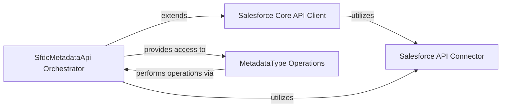

## Component Details

This component overview describes the structure and interactions within the Salesforce Metadata API Client subsystem. The core purpose of this subsystem is to facilitate programmatic interaction with the Salesforce Metadata API, enabling operations such as deployment, retrieval, and CRUD-like actions on metadata components. It leverages a foundational Salesforce API client for authenticated sessions and a generic API connector for underlying communication, orchestrating complex metadata operations through dedicated interfaces for deployment/retrieval and individual metadata type manipulations.

### Salesforce Core API Client
This component represents the foundational Salesforce API client, providing the base for authenticated sessions and generic API request handling. The `SfdcMetadataApi` extends this core functionality.

**Related Classes/Methods**:

- `simple_salesforce.api.Salesforce` (full file reference)

### SfdcMetadataApi Orchestrator
This is the central API interface for interacting with the Salesforce Metadata API. It extends the core Salesforce API client, acts as a factory for MetadataType objects, and orchestrates both deployment and retrieval processes, including status checks and result parsing.

**Related Classes/Methods**:

- <a href="https://github.com/simple-salesforce/simple-salesforce/blob/master/simple_salesforce/metadata.py#L196-L656" target="_blank" rel="noopener noreferrer">`simple_salesforce.metadata.SfdcMetadataApi` (196:656)</a>
- <a href="https://github.com/simple-salesforce/simple-salesforce/blob/master/simple_salesforce/metadata.py#L236-L242" target="_blank" rel="noopener noreferrer">`simple_salesforce.metadata.SfdcMetadataApi:__getattr__` (236:242)</a>
- <a href="https://github.com/simple-salesforce/simple-salesforce/blob/master/simple_salesforce/metadata.py#L271-L346" target="_blank" rel="noopener noreferrer">`simple_salesforce.metadata.SfdcMetadataApi:deploy` (271:346)</a>
- <a href="https://github.com/simple-salesforce/simple-salesforce/blob/master/simple_salesforce/metadata.py#L350-L362" target="_blank" rel="noopener noreferrer">`simple_salesforce.metadata.SfdcMetadataApi:_read_deploy_zip` (350:362)</a>
- <a href="https://github.com/simple-salesforce/simple-salesforce/blob/master/simple_salesforce/metadata.py#L365-L405" target="_blank" rel="noopener noreferrer">`simple_salesforce.metadata.SfdcMetadataApi:_retrieve_deploy_result` (365:405)</a>
- <a href="https://github.com/simple-salesforce/simple-salesforce/blob/master/simple_salesforce/metadata.py#L415-L500" target="_blank" rel="noopener noreferrer">`simple_salesforce.metadata.SfdcMetadataApi:check_deploy_status` (415:500)</a>
- <a href="https://github.com/simple-salesforce/simple-salesforce/blob/master/simple_salesforce/metadata.py#L502-L507" target="_blank" rel="noopener noreferrer">`simple_salesforce.metadata.SfdcMetadataApi:download_unit_test_logs` (502:507)</a>
- <a href="https://github.com/simple-salesforce/simple-salesforce/blob/master/simple_salesforce/metadata.py#L509-L563" target="_blank" rel="noopener noreferrer">`simple_salesforce.metadata.SfdcMetadataApi:retrieve` (509:563)</a>
- <a href="https://github.com/simple-salesforce/simple-salesforce/blob/master/simple_salesforce/metadata.py#L566-L598" target="_blank" rel="noopener noreferrer">`simple_salesforce.metadata.SfdcMetadataApi:retrieve_retrieve_result` (566:598)</a>
- <a href="https://github.com/simple-salesforce/simple-salesforce/blob/master/simple_salesforce/metadata.py#L600-L630" target="_blank" rel="noopener noreferrer">`simple_salesforce.metadata.SfdcMetadataApi:retrieve_zip` (600:630)</a>
- <a href="https://github.com/simple-salesforce/simple-salesforce/blob/master/simple_salesforce/metadata.py#L632-L656" target="_blank" rel="noopener noreferrer">`simple_salesforce.metadata.SfdcMetadataApi:check_retrieve_status` (632:656)</a>
- <a href="https://github.com/simple-salesforce/simple-salesforce/blob/master/simple_salesforce/metadata.py#L408-L413" target="_blank" rel="noopener noreferrer">`simple_salesforce.metadata.SfdcMetadataApi.get_component_error_count` (408:413)</a>

### MetadataType Operations
This component encapsulates the core CRUD-like operations (create, update, upsert, delete, rename) for individual Salesforce metadata types, leveraging the `SfdcMetadataApi` for communication. It includes the internal error handling mechanism for these operations.

**Related Classes/Methods**:

- <a href="https://github.com/simple-salesforce/simple-salesforce/blob/master/simple_salesforce/metadata.py#L19-L193" target="_blank" rel="noopener noreferrer">`simple_salesforce.metadata.MetadataType` (19:193)</a>
- <a href="https://github.com/simple-salesforce/simple-salesforce/blob/master/simple_salesforce/metadata.py#L77-L92" target="_blank" rel="noopener noreferrer">`simple_salesforce.metadata.MetadataType:create` (77:92)</a>
- <a href="https://github.com/simple-salesforce/simple-salesforce/blob/master/simple_salesforce/metadata.py#L116-L132" target="_blank" rel="noopener noreferrer">`simple_salesforce.metadata.MetadataType:update` (116:132)</a>
- <a href="https://github.com/simple-salesforce/simple-salesforce/blob/master/simple_salesforce/metadata.py#L134-L150" target="_blank" rel="noopener noreferrer">`simple_salesforce.metadata.MetadataType:upsert` (134:150)</a>
- <a href="https://github.com/simple-salesforce/simple-salesforce/blob/master/simple_salesforce/metadata.py#L152-L168" target="_blank" rel="noopener noreferrer">`simple_salesforce.metadata.MetadataType:delete` (152:168)</a>
- <a href="https://github.com/simple-salesforce/simple-salesforce/blob/master/simple_salesforce/metadata.py#L170-L183" target="_blank" rel="noopener noreferrer">`simple_salesforce.metadata.MetadataType:rename` (170:183)</a>
- <a href="https://github.com/simple-salesforce/simple-salesforce/blob/master/simple_salesforce/metadata.py#L47-L65" target="_blank" rel="noopener noreferrer">`simple_salesforce.metadata.MetadataType._handle_api_response` (47:65)</a>

### Salesforce API Connector
This component provides a generic utility function for making authenticated calls to the Salesforce API, abstracting away the underlying HTTP request details. It serves as a common communication layer used by various parts of the `simple-salesforce` library, including the Metadata API client.

**Related Classes/Methods**:

- <a href="https://github.com/simple-salesforce/simple-salesforce/blob/master/simple_salesforce/util.py#L92-L110" target="_blank" rel="noopener noreferrer">`simple_salesforce.util.call_salesforce` (92:110)</a>

### [FAQ](https://github.com/CodeBoarding/GeneratedOnBoardings/tree/main?tab=readme-ov-file#faq)