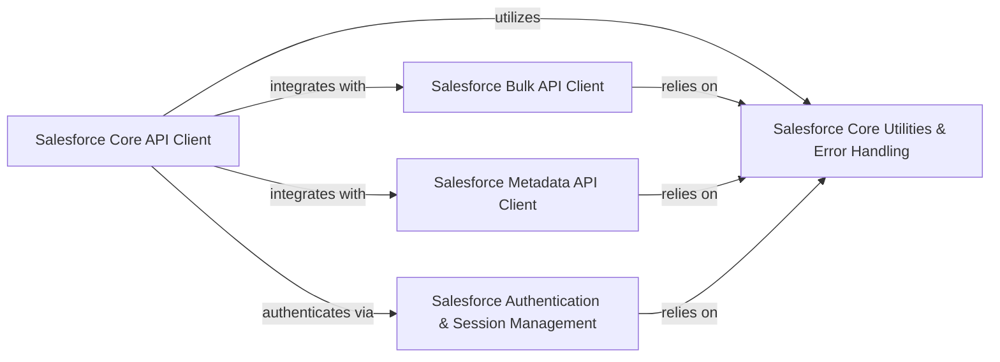

## Component Details

The `simple-salesforce` library provides a comprehensive Python interface for interacting with various Salesforce APIs, including the REST API, Bulk API (v1 and v2), and Metadata API. The main flow involves authenticating with Salesforce, performing data operations (queries, DML, bulk loads), and managing metadata, all while leveraging a set of core utility functions and a structured exception handling system.

### Salesforce Core API Client
This component provides the primary interface for interacting with the Salesforce REST API. It handles session management, general queries (SOQL), searches (SOSL), direct REST calls, and acts as a gateway to specific SObject types (via SFType), Bulk API v1, Bulk API v2, and Metadata API.

**Related Classes/Methods**:

- <a href="https://github.com/simple-salesforce/simple-salesforce/blob/master/simple_salesforce/api.py#L39-L460" target="_blank" rel="noopener noreferrer">`simple_salesforce.api.Salesforce` (39:460)</a>
- <a href="https://github.com/simple-salesforce/simple-salesforce/blob/master/simple_salesforce/api.py#L463-L549" target="_blank" rel="noopener noreferrer">`simple_salesforce.api.SFType` (463:549)</a>

### Salesforce Bulk API Client
This component manages interactions with both Salesforce Bulk API v1 and v2. It facilitates large-scale asynchronous data operations such as insert, update, delete, upsert, and query, handling job creation, batch management, and result retrieval for both API versions.

**Related Classes/Methods**:

- <a href="https://github.com/simple-salesforce/simple-salesforce/blob/master/simple_salesforce/bulk.py#L18-L66" target="_blank" rel="noopener noreferrer">`simple_salesforce.bulk.SFBulkHandler` (18:66)</a>
- <a href="https://github.com/simple-salesforce/simple-salesforce/blob/master/simple_salesforce/bulk.py#L69-L657" target="_blank" rel="noopener noreferrer">`simple_salesforce.bulk.SFBulkType` (69:657)</a>
- <a href="https://github.com/simple-salesforce/simple-salesforce/blob/master/simple_salesforce/bulk2.py#L149-L179" target="_blank" rel="noopener noreferrer">`simple_salesforce.bulk2.SFBulk2Handler` (149:179)</a>
- <a href="https://github.com/simple-salesforce/simple-salesforce/blob/master/simple_salesforce/bulk2.py#L182-L440" target="_blank" rel="noopener noreferrer">`simple_salesforce.bulk2._Bulk2Client` (182:440)</a>
- <a href="https://github.com/simple-salesforce/simple-salesforce/blob/master/simple_salesforce/bulk2.py#L443-L669" target="_blank" rel="noopener noreferrer">`simple_salesforce.bulk2.SFBulk2Type` (443:669)</a>
- <a href="https://github.com/simple-salesforce/simple-salesforce/blob/master/simple_salesforce/bulk2.py#L69-L110" target="_blank" rel="noopener noreferrer">`simple_salesforce.bulk2._split_csv` (69:110)</a>
- <a href="https://github.com/simple-salesforce/simple-salesforce/blob/master/simple_salesforce/bulk2.py#L113-L127" target="_blank" rel="noopener noreferrer">`simple_salesforce.bulk2._count_csv` (113:127)</a>
- <a href="https://github.com/simple-salesforce/simple-salesforce/blob/master/simple_salesforce/bulk2.py#L130-L146" target="_blank" rel="noopener noreferrer">`simple_salesforce.bulk2._convert_dict_to_csv` (130:146)</a>

### Salesforce Metadata API Client
This component provides functionalities to interact with the Salesforce Metadata API, allowing for programmatic deployment, retrieval, creation, updating, upserting, deleting, and renaming of metadata components within a Salesforce organization. It uses SOAP-based communication.

**Related Classes/Methods**:

- <a href="https://github.com/simple-salesforce/simple-salesforce/blob/master/simple_salesforce/metadata.py#L19-L193" target="_blank" rel="noopener noreferrer">`simple_salesforce.metadata.MetadataType` (19:193)</a>
- <a href="https://github.com/simple-salesforce/simple-salesforce/blob/master/simple_salesforce/metadata.py#L196-L656" target="_blank" rel="noopener noreferrer">`simple_salesforce.metadata.SfdcMetadataApi` (196:656)</a>

### Salesforce Authentication & Session Management
This module is responsible for managing various authentication flows with Salesforce, including username/password with security token, IP filtering, OAuth 2.0 password flow, JWT bearer token flow, and client credentials flow. It establishes and refreshes Salesforce sessions.

**Related Classes/Methods**:

- <a href="https://github.com/simple-salesforce/simple-salesforce/blob/master/simple_salesforce/login.py#L26-L228" target="_blank" rel="noopener noreferrer">`simple_salesforce.login.SalesforceLogin` (26:228)</a>
- <a href="https://github.com/simple-salesforce/simple-salesforce/blob/master/simple_salesforce/login.py#L231-L274" target="_blank" rel="noopener noreferrer">`simple_salesforce.login.soap_login` (231:274)</a>
- <a href="https://github.com/simple-salesforce/simple-salesforce/blob/master/simple_salesforce/login.py#L277-L319" target="_blank" rel="noopener noreferrer">`simple_salesforce.login.token_login` (277:319)</a>

### Salesforce Core Utilities & Error Handling
This foundational component provides common utility functions, robust exception handling, and SOQL query formatting capabilities used across the `simple-salesforce` library to support various API interactions and ensure structured error reporting.

**Related Classes/Methods**:

- <a href="https://github.com/simple-salesforce/simple-salesforce/blob/master/simple_salesforce/util.py#L92-L110" target="_blank" rel="noopener noreferrer">`simple_salesforce.util.call_salesforce` (92:110)</a>
- <a href="https://github.com/simple-salesforce/simple-salesforce/blob/master/simple_salesforce/util.py#L70-L89" target="_blank" rel="noopener noreferrer">`simple_salesforce.util.exception_handler` (70:89)</a>
- <a href="https://github.com/simple-salesforce/simple-salesforce/blob/master/simple_salesforce/util.py#L112-L119" target="_blank" rel="noopener noreferrer">`simple_salesforce.util.list_from_generator` (112:119)</a>
- <a href="https://github.com/simple-salesforce/simple-salesforce/blob/master/simple_salesforce/util.py#L59-L67" target="_blank" rel="noopener noreferrer">`simple_salesforce.util.date_to_iso8601` (59:67)</a>
- <a href="https://github.com/simple-salesforce/simple-salesforce/blob/master/simple_salesforce/util.py#L35-L56" target="_blank" rel="noopener noreferrer">`simple_salesforce.util.getUniqueElementValueFromXmlString` (35:56)</a>
- <a href="https://github.com/simple-salesforce/simple-salesforce/blob/master/simple_salesforce/exceptions.py#L5-L39" target="_blank" rel="noopener noreferrer">`simple_salesforce.exceptions.SalesforceError` (5:39)</a>
- <a href="https://github.com/simple-salesforce/simple-salesforce/blob/master/simple_salesforce/exceptions.py#L42-L49" target="_blank" rel="noopener noreferrer">`simple_salesforce.exceptions.SalesforceMoreThanOneRecord` (42:49)</a>
- <a href="https://github.com/simple-salesforce/simple-salesforce/blob/master/simple_salesforce/exceptions.py#L52-L59" target="_blank" rel="noopener noreferrer">`simple_salesforce.exceptions.SalesforceMalformedRequest` (52:59)</a>
- <a href="https://github.com/simple-salesforce/simple-salesforce/blob/master/simple_salesforce/exceptions.py#L62-L69" target="_blank" rel="noopener noreferrer">`simple_salesforce.exceptions.SalesforceExpiredSession` (62:69)</a>
- <a href="https://github.com/simple-salesforce/simple-salesforce/blob/master/simple_salesforce/exceptions.py#L72-L79" target="_blank" rel="noopener noreferrer">`simple_salesforce.exceptions.SalesforceRefusedRequest` (72:79)</a>
- <a href="https://github.com/simple-salesforce/simple-salesforce/blob/master/simple_salesforce/exceptions.py#L82-L93" target="_blank" rel="noopener noreferrer">`simple_salesforce.exceptions.SalesforceResourceNotFound` (82:93)</a>
- <a href="https://github.com/simple-salesforce/simple-salesforce/blob/master/simple_salesforce/exceptions.py#L96-L113" target="_blank" rel="noopener noreferrer">`simple_salesforce.exceptions.SalesforceAuthenticationFailed` (96:113)</a>
- <a href="https://github.com/simple-salesforce/simple-salesforce/blob/master/simple_salesforce/exceptions.py#L116-L124" target="_blank" rel="noopener noreferrer">`simple_salesforce.exceptions.SalesforceGeneralError` (116:124)</a>
- <a href="https://github.com/simple-salesforce/simple-salesforce/blob/master/simple_salesforce/exceptions.py#L127-L128" target="_blank" rel="noopener noreferrer">`simple_salesforce.exceptions.SalesforceOperationError` (127:128)</a>
- <a href="https://github.com/simple-salesforce/simple-salesforce/blob/master/simple_salesforce/exceptions.py#L131-L134" target="_blank" rel="noopener noreferrer">`simple_salesforce.exceptions.SalesforceBulkV2LoadError` (131:134)</a>
- <a href="https://github.com/simple-salesforce/simple-salesforce/blob/master/simple_salesforce/exceptions.py#L137-L140" target="_blank" rel="noopener noreferrer">`simple_salesforce.exceptions.SalesforceBulkV2ExtractError` (137:140)</a>
- <a href="https://github.com/simple-salesforce/simple-salesforce/blob/master/simple_salesforce/format.py#L25-L40" target="_blank" rel="noopener noreferrer">`simple_salesforce.format.SoqlFormatter` (25:40)</a>
- <a href="https://github.com/simple-salesforce/simple-salesforce/blob/master/simple_salesforce/format.py#L43-L45" target="_blank" rel="noopener noreferrer">`simple_salesforce.format.format_soql` (43:45)</a>
- <a href="https://github.com/simple-salesforce/simple-salesforce/blob/master/simple_salesforce/format.py#L49-L73" target="_blank" rel="noopener noreferrer">`simple_salesforce.format.quote_soql_value` (49:73)</a>

### [FAQ](https://github.com/CodeBoarding/GeneratedOnBoardings/tree/main?tab=readme-ov-file#faq)